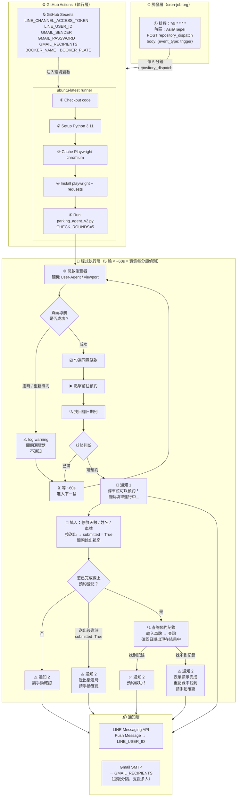

# 停車場預約偵測 Agent

自動偵測 [pcc.youparking.com.tw](https://pcc.youparking.com.tw/parkingreserve/#/) 的指定日期是否開放預約，  
一旦出現可預約按鈕，立即自動填單送出，並透過 **LINE** 和 **Gmail** 雙重通知。

本機不需要一直開著，完全透過免費雲端服務運作。

---

## 專案架構圖



---

## 檔案結構

```
.
├── .github/
│   └── workflows/
│       └── parking.yml         # GitHub Actions 排程與執行設定
├── parking_book/
│   ├── parking_agent_v2.py     # 主程式（正式執行）
│   ├── parking_agent.ipynb     # 互動式偵錯 notebook
│   ├── parking_agent.py        # 舊版備用
│   └── .env.example            # 環境變數範本（本機測試用）
└── README.md
```

---

## 快速部署

### 1. Fork 此 repo

### 2. 修改目標日期與停放天數

編輯 [parking_book/parking_agent_v2.py](parking_book/parking_agent_v2.py)：

```python
TARGET_DATE  = "05-23"   # 頁面格式 "2026-05-23 (六)"，填月-日即可
PARKING_DAYS = int(os.environ.get("PARKING_DAYS", "5"))   # 預設 5 天
```

### 3. 設定 GitHub Secrets

**Settings → Secrets and variables → Actions → New repository secret**

| Secret 名稱 | 說明 |
|-------------|------|
| `LINE_CHANNEL_ACCESS_TOKEN` | LINE Messaging API Channel Access Token |
| `LINE_USER_ID` | 接收通知的 LINE User ID（U 開頭） |
| `GMAIL_SENDER` | 寄件 Gmail |
| `GMAIL_PASSWORD` | Gmail 應用程式密碼 |
| `GMAIL_RECIPIENTS` | 收件人，多人逗號分隔：`a@gmail.com,b@gmail.com` |
| `BOOKER_NAME` | 預約人姓名 |
| `BOOKER_PLATE` | 車牌號碼 |

### 4. 設定 cron-job.org（讓 GitHub Actions 每分鐘觸發）

> GitHub Actions 的 cron 最短只能每 5 分鐘且有延遲，改用 cron-job.org 主動呼叫更穩定。

1. 前往 [cron-job.org](https://cron-job.org) 免費註冊
2. 建立新工作，填入以下設定：

| 欄位 | 值 |
|------|-----|
| **URL** | `https://api.github.com/repos/你的帳號/parking-agent/dispatches` |
| **排程** | `*/5 * * * *` |
| **時區** | `Asia/Taipei` |
| **Request method** | `POST` |
| **Request body** | `{"event_type": "trigger"}` |
| **Headers** | `Authorization: Bearer <你的 GitHub PAT>` |
| **Headers** | `Content-Type: application/json` |

3. GitHub PAT 申請：**Settings → Developer settings → Personal access tokens → Tokens (classic)**  
   勾選 `repo` 和 `workflow` 權限

> ⚠️ PAT 只填在 cron-job.org 的設定頁面，**絕對不能寫進程式碼或 README**

### 5. 確認 Actions 已啟用

repo → **Actions** → 確認 workflow 已 Enable

---

## 本機偵錯

```bash
pip install playwright requests python-dotenv
playwright install chromium

cp parking_book/.env.example parking_book/.env
# 編輯 .env 填入真實值

cd parking_book
python parking_agent_v2.py
```

開啟 `parking_agent.ipynb` 可逐步執行，觀察瀏覽器畫面與每個 selector 的命中狀況。

---

## LINE Messaging API 申請

1. [LINE Developers Console](https://developers.line.biz/console/) → 建立 Messaging API Channel
2. Channel → Messaging API → Issue **Channel access token**（長期）
3. 掃 QR code 加入官方帳號，傳一則訊息
4. 頁面底部 **Your user ID** = `LINE_USER_ID`

> 免費方案每月 200 則 Push Message

---

## Gmail 應用程式密碼

1. Google 帳號 → 安全性 → 應用程式密碼（需先開啟兩步驟驗證）
2. 新增 → 取得 16 碼密碼 → 填入 `GMAIL_PASSWORD` Secret

---

## 逾時與錯誤處理

| 發生時機 | 行為 | 是否通知 |
|---------|------|---------|
| 頁面導航逾時 / 重新導向 | log warning，關閉瀏覽器，下一輪重試 | ❌ 不通知 |
| 填單過程逾時（送出前） | log warning，下一輪重試 | ❌ 不通知 |
| 送出後逾時（狀態不明） | log error，停止輪詢 | ✅ 通知（請手動確認） |
| 未偵測到「您已完成線上預約登記」| log warning，停止輪詢 | ✅ 通知（請手動確認） |
| 偵測到完成訊息 → 查詢記錄找到日期 | log info，停止輪詢 | ✅ 通知預約成功 |
| 偵測到完成訊息 → 查詢記錄找不到 | log warning，停止輪詢 | ✅ 通知（請手動確認） |

---

## 注意事項

- `parking_agent.ipynb` 含本機偵錯用明文設定，**請勿上傳 GitHub**
- `.env` 已在 `.gitignore`，不會被 git 追蹤
- cron-job.org 的 GitHub PAT **只放在 cron-job.org 設定頁面**，不放任何檔案
- GitHub Actions cron 排程有 5～30 分鐘延遲，這是使用 cron-job.org 觸發的原因
